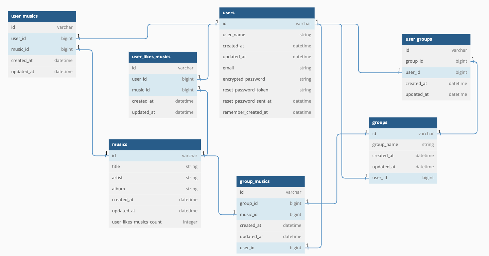

# README

RingleMusic - taeheon.ki

Version
* ruby: 2.6.3p62
* rails: 6.1.7
* mysql: 8.0.31

Install
* bundle
* rake db:create
* rake db:migrate
* rake db:seed
  - 유저 10,000명
  - 그룹 100개
  - 음원 1500개 + fake 음원 100만개
  - 유저의 좋아요 10,000개
  - 소요시간 1시간 3분

Modeling (Attributes)

* 핵심 내용
  * 서비스화
    * 가독성 좋은 API를 위한 Modularization
    * 서비스화를 통해 API단에서 Authentication -> Services(processing) -> return(with exception handling)의 세 단계를 거치는 것으로 메커니즘 통일
  * Authentication
    * user가 login할 때 jwt_token 발급해서 전달해줌. 플레이리스트 추가, 좋아요 누르기 요청이 들어오면 jwt_token을 decode하여 user_id를 얻어 작업을 수행함.
    * 의문점 : but bad guy가 똑같은 request를 Replay하면 어떻게 되지? => 이따가 공부한 부분에 대해 이야기
    * jwt_token의 Validation (코드로 Go)
  * eager loading, pre loading, lazy loading
    * ToWrite
  * 검색 매커니즘
    * Soundex를 이용하여 발음이 비슷한 것들도 함께 찾아주는 기능 추가 => 100만건에 대해 ordering => 1.2초
      * [EX] newjeens를 검색해도 newjeans를 반환
    * Soundex를 이용하지 않은 just keyword search => 100만건에 대해 ordering => 0.8초
      * db단에서 soundex 적용하는 것보다 메모리단에서 쿼리에 대해 오타 잡아주는 등 프로세싱해주는 함수 구현하여 사용할 수 있으면 좋을것.
  * 정렬 매커니즘 with limit
    * 좋아요 순, 최신순 => 검색을 통해 musics를 찾은 후 musics.order.(attributes: :desc).limit(~)로 구현. all rows에 대해 ordering 진행 후 Limit으로 상위 몇 개만 가져올 수 있도록.
    * 정확도 순 => 검색을 통해 musics를 찾은 후 중에 길이가 가장 비슷한 순서로 상위로 오도록 정렬
  * Indexing
    * 음원 검색의 속도를 위해 Music 모델의 title, artist, album attributes에 index 설정을 해줌.
    * signup, signin을 할 때 User.findby email을 수행하기 때문에 여기에도 index 설정을 해줌.
  * Convention 적용 연습
    * grape-entity 적용하여 response
    * service화 할 때 naming convention 연습
    * service단에서 raise exception -> api단에서 begin rescue
  * 뮤직 여러개 insert mechanism (코드로 Go)
  * 뮤직 여러개 destroy mechanism (코드로 Go)
  * counter_cache 사용하여 user가 music에 좋아요를 누르거나 취소할 때마다 Music model의 해당하는 row의 attribute를 increment, decrement

* 구현한 API들
  * Postman으로 시현을 하는게 좋을까요 아니면 그냥 넘어갈까요?

* Todo
  - eager loading, preloading, lazy loading reasoning
  - 플레이리스트에 여러 음원 insert할 때 100개 넘어가면 옛날거부터 지우는 코드에 concurrency problem reasoning